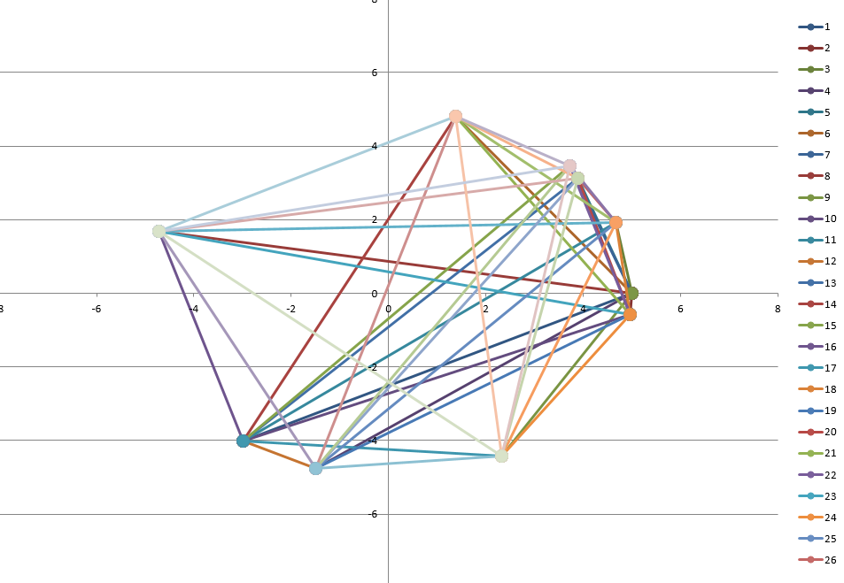

# clique_eigenvalues

here i have a miserable try to understand the fameous [clique problem](https://de.wikipedia.org/wiki/Clique_(Graphentheorie)).

In short, this is some ancient python2.7 code which solves an eigenvalue probem of the clicks connected with each other.
The print is on excel, so that one can see the numbers and can get a feeling about it.

